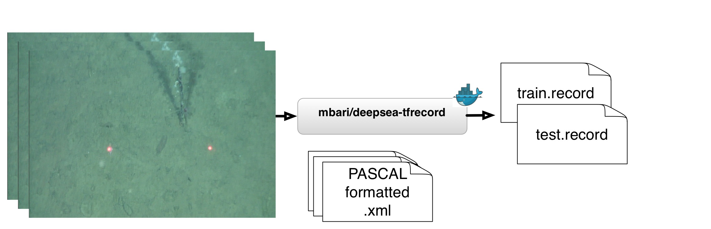

# About

*deepsea-tfrecord* creates TensorFlow records files from PNG images and [PASCAL](http://host.robots.ox.ac.uk/pascal/VOC/) formatted annotations for use in the Tensorflow Object Detection API.
    
